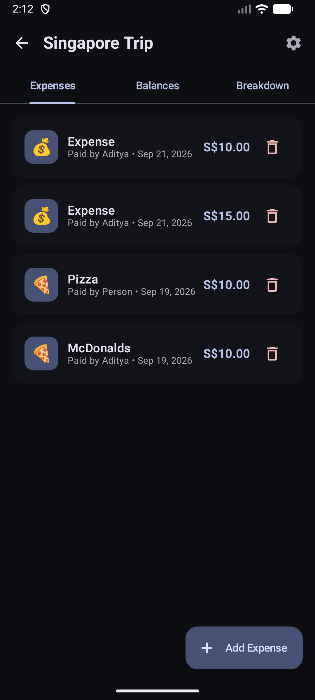
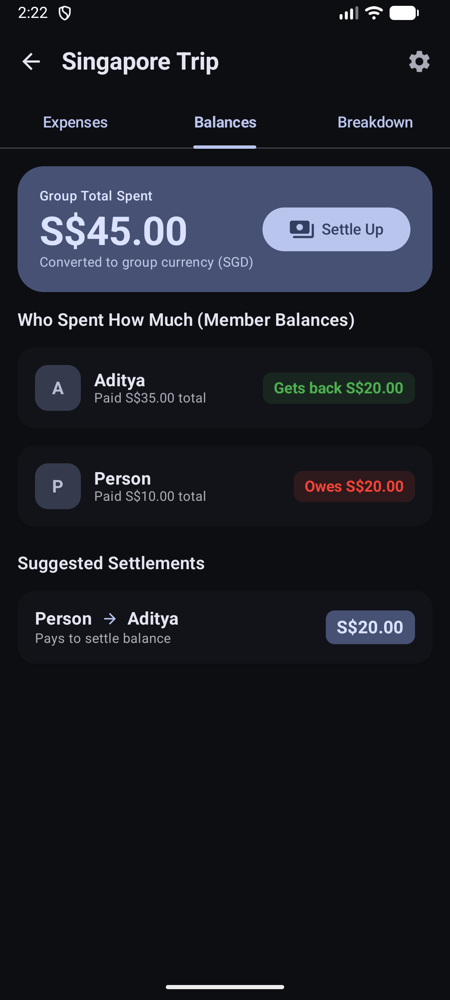
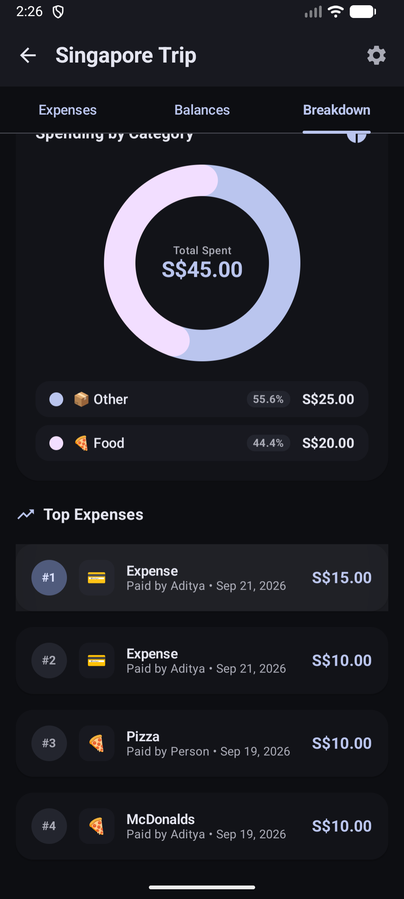
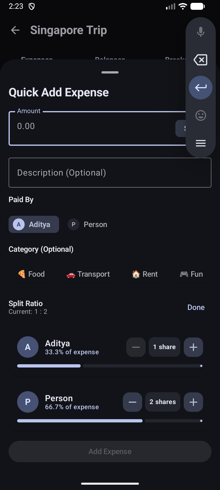
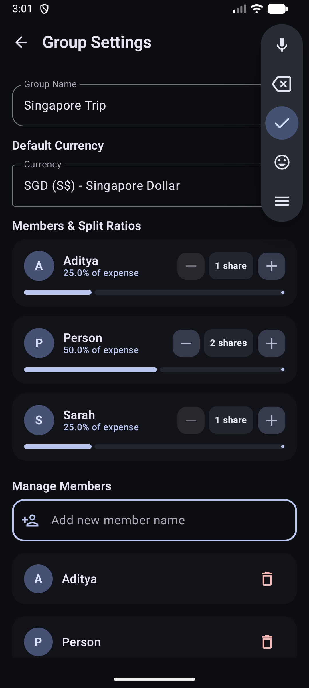

# SplitUp 💸

An offline-first, multi-currency group expense sharing and split tracking Android app built with **Jetpack Compose** and crafted as a showcase for **Material 3 Expressive** design.

[](https://kotlinlang.org)
[](https://developer.android.com/jetpack/compose)
[](https://m3.material.io)
[](https://developer.android.com)
[](https://developer.android.com)

---

## ✨ Material 3 Expressive Showcase

SplitUp is built from the ground up to follow Google's latest **Material 3 Expressive** guidelines, combining bold shapes, tactile spring physics, rich color roles, and interactive feedback:

- 🌀 **Expressive Motion & Physics**: Powered by `MotionScheme.expressive()` and low-bouncy spring physics (`Spring.DampingRatioLowBouncy`, `Spring.StiffnessLow`) across progress indicators, category charts, and sheet transitions.
- 🎚️ **Live Visual Ratio Stepper**: Custom-built interactive split sliders with live spring-animated `LinearProgressIndicator`, circular avatar badges, and tactile steppers (`[-]` `[+]`).
- 🍩 **Native Compose Donut Chart**: Rendered directly with Compose `Canvas` and animated entry arcs, spotlighting spending distribution and total expenditure in the group's base currency.
- 📳 **Haptic Feedback**: Integrated micro-haptics (`LocalHapticFeedback`) on stepper clicks, payer toggles, category chips, and settlement actions.
- 🔲 **Expressive Shapes & Elevation**: Embraces generous radii (`16.dp` text fields, `20.dp` / `24.dp` container cards, `28.dp` bottom sheets) with tonal color elevation (`surfaceContainerLow`, `surfaceContainerHighest`).
- 📱 **Edge-to-Edge & Gesture Navigation**: Seamless swipe gestures with `HorizontalPager` and predictive back transitions.

---

## 📸 Screenshots

| Expenses | Balances & Settlements | Breakdown Analytics |
|:---:|:---:|:---:|
|  |  |  |

| Quick Add Expense | Interactive Split Ratios | Group Settings |
|:---:|:---:|:---:|
|  |  |  |

---

## 🚀 Core Features

- **Split Groups**: Organize expenses by trip, household, or event.
- **Flexible Weighted Splits**: Split equally or assign custom share ratios per member (e.g., 2 shares vs 1 share) with real-time percentage feedback.
- **Smart Debt Simplification**: Built-in settlement algorithm minimizes total transactions required to settle up balances.
- **Multi-Currency & Conversion**:
  - Assign any base currency to a group (USD, SGD, EUR, GBP, INR, JPY, AUD, etc.).
  - Add expenses in different currencies with automatic real-time rate conversion and offline caching.
- **Category Spending Analytics**:
  - Interactive Donut chart visualizing spend proportion by category (Food, Transport, Rent, Fun, Other).
  - Ranked Top Expenses list sorted in descending order of spending.
- **Offline-First**: All data is stored locally via Room Database; works completely offline with zero mandatory cloud accounts.

---

## 🏗️ Architecture & Tech Stack

SplitUp follows Google's recommended Android Architecture guidelines:

- **UI Framework**: [Jetpack Compose](https://developer.android.com/jetpack/compose) with Material 3 Expressive (`androidx.compose.material3:material3`)
- **Architecture**: MVVM (Model-View-ViewModel) + Unidirectional Data Flow (UDF)
- **State Management**: Kotlin Coroutines & `StateFlow` (`collectAsStateWithLifecycle`)
- **Database & Persistence**: [Room Database](https://developer.android.com/training/data-storage/room) with TypeConverters
- **Navigation**: [Navigation Compose](https://developer.android.com/guide/navigation/navigation-compose) with Type-Safe Kotlin Serialization
- **Networking**: Ktor Client for fetching currency exchange rates

```
com.example.expensetracker/
├── data/
│   ├── dao/             # Room DAOs (GroupDao, MemberDao, ExpenseDao)
│   ├── model/           # Room Entities (SplitGroup, Member, Expense)
│   ├── network/         # Currency API Client
│   └── repository/      # Repository Layer (Single source of truth)
├── domain/              # CurrencyUtils, Debt Simplification Engine
├── ui/
│   ├── components/      # Reusable M3 Expressive Components (RatioEditor, CurrencyPicker)
│   ├── navigation/      # Type-safe Compose navigation routes
│   ├── screens/
│   │   ├── home/        # Group list & overview
│   │   ├── create/      # 5-step interactive group wizard
│   │   ├── group/       # Group Details (Expenses, Balances, Breakdown tabs)
│   │   └── settings/    # Group management & member ratios
│   └── theme/           # Material 3 Color Schemes & Expressive MotionScheme
└── MainActivity.kt      # Edge-to-edge Compose host
```

---

## 🛠️ Getting Started

### Prerequisites
- Android Studio Ladybug (2024.2.1+) or newer
- JDK 17+
- Android SDK 35 (compileSdk 35)

### Building & Running
1. Clone the repository:
   ```bash
   git clone https://github.com/AdityaHebballe/SplitUp.git
   cd SplitUp
   ```
2. Open the project in Android Studio.
3. Build the debug APK via Gradle:
   ```bash
   ./gradlew assembleDebug
   ```
4. Install to a connected device or emulator:
   ```bash
   ./gradlew installDebug
   ```

---

## 📄 License

```
Copyright 2026 Aditya Hebballe

Licensed under the Apache License, Version 2.0 (the "License");
you may not use this file except in compliance with the License.
You may obtain a copy of the License at

    http://www.apache.org/licenses/LICENSE-2.0

Unless required by applicable law or agreed to in writing, software
distributed under the License is distributed on an "AS IS" BASIS,
WITHOUT WARRANTIES OR CONDITIONS OF ANY KIND, either express or implied.
See the License for the specific language governing permissions and
limitations under the License.
```
